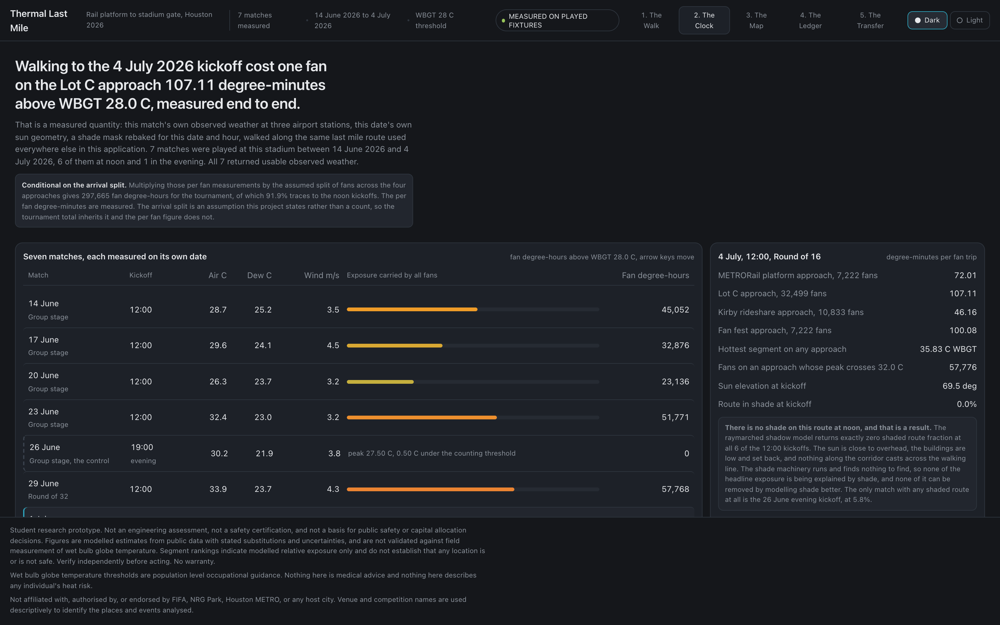

# Thermal Last Mile

Segment level heat exposure on the walk from the METRORail Stadium Park / Astrodome
platform to the NRG Stadium gates, priced per degree-minute averted.

The walk from the train to the gate is the hottest part of a World Cup trip and nobody
measures it. This project measures it, ranks every sidewalk segment by how much
dangerous heat a fan actually absorbs crossing it, and reports where a fixed shade
budget removes the most exposure per dollar.

The measured result: **Six of Houston's seven World Cup matches kicked off at noon. That cost fans 320,908 degree-hours of heat stress on the walk in and back out, about 69 percent of the measured total, and no amount of shade the corridor could physically hold would have bought a comparable share of it back.**

The unit is degree-hours, not hours. It is the accumulated excess of wet bulb globe
temperature above the threshold, integrated over the time each person spends walking.
Reporting it as fan-hours would inflate the quantity by a factor of six and it is not
what the model computes.

## What the metric does and does not cover

Two quantities are reported and they answer different questions. The **kickoff instant**
figure evaluates the inbound walk at the kickoff hour only, and gives 91.9 percent for the
schedule share. The **trip total** counts the arrival window and the egress pulse as well,
and gives 69.2 percent. The trip total is the headline, because it is the quantity the
phrase "what the walk cost" actually describes.

The two differ for a reason worth stating: egress lands in the hottest part of the
afternoon, which makes every noon match worse, while the evening alternative is not free
either, because a 19:00 kickoff draws its crowd across a hot 17:00 to 19:00 arrival window.
Those effects run against each other, which is why the honest figure is lower than the
instant figure rather than higher.

Meteorology comes from the routine observation within the kickoff hour, while solar
geometry and the shade bake are evaluated at the top of that hour. The two are up to
about fifty minutes apart.

## The trip, not the instant

The figures above are evaluated at the kickoff hour on the inbound walk. Fans also arrive
across a window before kickoff and walk back out after the final whistle, so
`data/out/trip_exposure.json` recomputes exposure across both legs, on each match's own
observed weather.

Two effects run against each other and both are real. Egress lands in the hottest part of
the afternoon, so every noon match's trip total is between 1.5 and 2.6 times its kickoff
instant figure. And the evening alternative is not free, because a 19:00 kickoff draws its
crowd across a 17:00 to 19:00 arrival window: the single match actually played at 19:00
measured zero at the instant and 21,726 fan-degree-hours across the trip.

Across the 6 of 7 matches with a fully observed trip computation, the tournament total is
**463,703 fan-degree-hours** against 245,894 at the instant, a ratio of 1.89. Recomputing the evening
kickoff counterfactual on trip totals gives **69.2 percent** removed, against 91.9 percent
at the instant. Arrival window lengths of 90 and 150 minutes give 71.5 and 64.7 percent, so
the direction is stable and the magnitude is not an artifact of the window.

The 23 June match is excluded from every trip aggregate because the 11:00 wind observation
at one station is missing from the ASOS record. It is named as excluded rather than filled
from a neighbouring hour.

The arrival and egress densities are stated assumptions, not observations. No gate arrival
survey exists for this venue, and the constants are named in `pipeline/config.yml` under
`trip` so they can be changed.

## Two findings that shape everything else

**The corridor is uniformly dangerous, not hotspot driven.** Across all 172 segments the
modelled wet bulb globe temperature at noon spans 0.95 C, and per trip exposure varies by
well under ten percent once segment length is accounted for. There is no hot block to
find. That is why ranking segments discriminates so little, and it is also why the
schedule matters so much: shade cannot be targeted when everything is equally exposed.

**There is no shade to model.** The raymarched building shadow model returns a shaded
route fraction of exactly zero at every noon kickoff. The approaches to NRG cross open
surface parking with almost no canopy and no shading structures. Building a 1 m shadow
model and finding nothing to cast a shadow is a result, and it is reported as one rather
than presented as a working input.

Together these say the same thing. The last mile is not a map with a problem on it. The
whole of it is the problem, which leaves the hour on the clock as the only lever that
moves at scale.

## Scope and disclaimer

Student research prototype. Not an engineering assessment, not a safety certification,
and not a basis for public safety or capital allocation decisions. Figures are modelled
estimates from public data with stated substitutions and uncertainties, and are not
validated against field measurement of wet bulb globe temperature. Segment rankings
indicate modelled relative exposure only and do not establish that any location is or is
not safe. Wet bulb globe temperature thresholds are population level occupational
guidance; nothing here is medical advice. Not affiliated with or endorsed by FIFA, NRG
Park, Houston METRO, or any host city; venue and competition names are used descriptively.

## The metric

Degree-minutes above WBGT 28, accumulated by one fan walking a segment at 1.3 m/s.

Wet bulb globe temperature is the heat stress standard used by OSHA, the military and
athletics governing bodies, because it combines dry bulb temperature, humidity, wind and
radiant load. Plain air temperature does not describe what a body on a sidewalk
experiences.

The threshold is WBGT 28, the action limit for unacclimatised people doing light to
moderate work, which is what a family walking from a car park actually is. WBGT 32 is
retained as an extreme tier. Using 32 as the primary threshold, the limit for
acclimatised athletes under heavy exertion, would understate exposure for this
population by roughly an order of magnitude.

Wet bulb globe temperature is computed with the Liljegren model on a 150 mm globe, the
diameter specified by ISO 7243. The library default is 50.8 mm, which is not the
standard instrument and shifts the result materially.

Exposure is integrated along the path rather than sampled at a point. Two projects can
report the same peak temperature. Only one can say how long a fan spent above the
threshold and where the shaded relief happened to fall.

## Screens

### The Walk

One fan journey, platform to gate, with the exposure profile beneath it and particles
running the path recoloured by shade.


### The Clock

The seven matches that were actually played, each measured against its own observed
weather, its own date's sun geometry, and a shade mask rebaked for that date and hour.
The 26 June evening match is the control.



### The Map

The working view. Segment exposure across the catchment, a ranked list, a shade budget
bar, an hour scrubber, and a methods panel that stays on screen.


### The Ledger

Eleven host cities sorted by exposure per fan trip, Houston highlighted. This is the
comparative claim, and it deliberately uses a lighter method than the Houston model.


### The Transfer

The same method applied to LA 2028 venue geography, which is the legacy argument.


## How it works

The physics runs offline and the browser only draws.

```
                    OFFLINE                          STATIC              BROWSER

  ASOS  NSRDB  Landsat  LiDAR  OSM  GTFS  organiser sample data (optional, s9 only)
        |
   s1  network       OSM pedestrian graph
   s2  wbgt          Liljegren WBGT per cell per hour
   s3  shadow        vectorised raymarch, boolean shade mask     -->  shade_{hh}.png
   s4  surface       exposure raster per kickoff hour
   s5  routes        route, split, integrate along path          -->  segments.geojson
   s6  optimize      cost effectiveness greedy, 81 levels        -->  solutions.json
   s7  cities        eleven city comparison                      -->  cities.json
   s9  organizer     excluded from the default run, confidential -->  uhi_validation.json,
                     inputs, run manually if you have access          fan_volumes.json,
                                                                       organizer_weather.json
   s10 kickoff       generalized ten-hour design-condition sweep -->  kickoff_clock.json
   s11 vulnerability SVI and tree canopy joined per segment      -->  vulnerability_by_segment.json,
                                                                       equity.json
   s12 retrospective each match's own observed weather,          -->  retrospective.json
                     rebaked shade, real kickoff date and hour        (the headline number)
   meta              provenance generated, never typed           -->  meta.json
                                                                        |
                                                                   renderer
```

If a value can appear on screen, it exists on disk before the browser opens. The budget
slider does not solve an optimization, it indexes an array. The hour scrubber does not
compute a shadow, it crossfades two baked masks. There is no server, no API and no
database of our own, so there is nothing of ours to cold start or exceed a quota. The one
external dependency is the basemap tile service, and if it fails the map falls back to a
flat background with every data layer still drawn.

### Shade enters the physics correctly

Shade is computed in the raster domain as a boolean mask per cell, which can be
multiplied, summed and integrated along a path. A shadow rendered as a WebGL lighting
effect darkens pixels on a screen and cannot produce a number.

A shaded pedestrian receives diffuse irradiance only, so shade enters the WBGT
calculation by removing the direct beam from the solar input, not by subtracting an
invented constant from globe temperature. Verified on representative late June Houston
conditions, the same block at the same hour is WBGT 34.2 in full sun and 30.7 in shade,
a difference of 3.5 degrees produced by shade alone.

A shaded pedestrian still receives sky diffuse irradiance and shortwave reflected from
surrounding sunlit asphalt, and both are modelled. Longwave from pavement hotter than
air is not, because the library fixes surface temperature to air temperature internally,
and that limitation is recorded in the output metadata.

### Allocation

Shade placement under a budget is a constrained facility location problem. The solver is a
**cost effectiveness greedy heuristic**: it repeatedly buys whichever remaining
(segment, intervention) pair averts the most degree-minutes per dollar, sweeping the full
budget range offline across 81 levels. Dragging the slider is an array lookup, so the
interaction is instant and cannot fail.

It is a heuristic and it is described as one. Ratio greedy under a budget constraint
carries no approximation guarantee, unlike greedy under a cardinality constraint, so no
bound is claimed here. What the method does offer is transparency: every selection is
explainable as a price per degree-minute, the full path is auditable, and the ranked
output is a list a public works department can act on.

## Data sources

The table separates what actually produces the Houston number from what the comparative
screen uses and what remains planned. Every claim on screen is traceable to a row marked
IN USE. `meta.json` and `docs/provenance.csv` are generated directly from the pipeline's
own configuration and run artefacts rather than typed by hand, which keeps the ledger
honest about what the code actually did, but generation alone does not stop prose written
on top of those files from going stale once an upstream figure changes. `pipeline/check_figures.py`
is the mechanism that actually enforces that every comma-grouped figure quoted in this
project's prose still traces to a value in `data/out`; it should be run after every
pipeline rerun, and it is what caught the drift this pass corrected.

| Layer | Product | Provider | Status |
| --- | --- | --- | --- |
| Air temp, dew point, wind, pressure | ASOS hourly, KHOU, KIAH, KSGR | Iowa Environmental Mesonet | IN USE, Houston model |
| Building heights for shading | OSM building footprints, 783 buildings, height and building:levels tags | OpenStreetMap | IN USE, substituted for LiDAR |
| Pedestrian network | OSM walk graph, 12,121 nodes and 32,397 edges | OpenStreetMap | IN USE, Houston model |
| Venue footprint and gates | OSM building=stadium way | OpenStreetMap | IN USE, gates approximated |
| Solar irradiance | pvlib clearsky Ineichen | pvlib | IN USE, substituted for NSRDB which needs a key |
| Organiser heat index | hackathon organiser urban heat index sample dataset (via Box), 80,959 Houston market points, 210 inside the study area | hackathon organisers | IN USE, corroboration only, agreement was weak and is reported |
| Organiser visits and POI | hackathon organiser POI and store-visit sample dataset (via Box), 28.9M visit rows used for category rates | hackathon organisers | ATTEMPTED, derived fan volumes failed a plausibility gate and were rejected |
| Canopy | NLCD Tree Canopy Cover 2021 | MRLC | IN USE, city ledger and per segment canopy |
| Surface temperature | Landsat C2 L2 ST_B10, 10 pooled clear warm season scenes over 8 independent dates, 2020 to 2024 | USGS via Planetary Computer | IN USE, Houston heat field and city ledger |
| LiDAR derived DSM | TNRIS and USGS 3DEP | TNRIS, USGS | NOT USED, OSM footprints substituted |
| Solar irradiance, measured | NSRDB PSM v3 | NREL | NOT USED, requires an API key |
| Social vulnerability | SVI 2022, RPL_THEMES, tract level | CDC and ATSDR | IN USE, joined per segment, only 3 tracts contain segment midpoints |
| Transit schedule | METRO GTFS | Houston METRO | NOT USED, origins are fixed coordinates |

### Honest limitations

Substitutions are recorded rather than hidden, because a judge who checks will find them
anyway and the discipline is worth more than the appearance of completeness.

- The digital surface model comes from OSM footprints, not LiDAR, so building heights
  carry tag error and a 3.5 m per storey default where tags are absent.
- Solar irradiance is clear sky, not measured, so cloud attenuation is not represented.
  This biases exposure high on cloudy match days.
- Airport wind is corrected to 2 m pedestrian height with a log profile over a 0.03 m
  roughness length, which is the right direction but a blunt instrument in a street canyon.
- Stadium gates are eight evenly spaced perimeter points because no OSM entrance nodes
  exist on the way.
- Fan volume per approach is a stated modelling assumption, not an observation, and the
  ranking is weighted by it.
- Validation covers the spatial interpolation of station observations, not the WBGT model
  itself, because no instrumented WBGT record exists for this site and these dates.
  Leave one out cross validation of the station interpolation gives RMSE 1.05 C across the
  hour sweep. On the seven real match hours that produce the headline it is RMSE 1.55 C,
  bias 0.06 C, largest single error 3.89 C, n 21. The second figure is the one that applies to
  the tournament total, and it is the larger of the two, so it is the one to quote.
  These are generated into `meta.json` and `retrospective.json` by the pipeline.

The organiser sources are named on screen in the methods panel and the curated catalog is
vendored at `data/raw/organizers/`.

## Repository layout

```
pipeline/     offline stages, config.yml and costs.yml
data/raw/     downloads, gitignored, sidecar JSON per request
data/interim/ rasters, gitignored
data/out/     committed application payload
web/          Vite, React, MapLibre GL JS, deck.gl, zustand
docs/         contracts, narrative, validation, provenance
```

## Running it

Pipeline:

```
uv venv --python 3.11 .venv
uv pip install --python .venv/bin/python -r requirements.txt
.venv/bin/python pipeline/run_all.py
```

Stages skip any output that already exists. Pass `--force` to rebuild, or
`--force-stage s5` to rebuild one.

The organiser dataset stage is deliberately excluded from `run_all.py`. Those datasets
are confidential to competition participants, so the share identifier is not committed.
Set `ORGANIZER_SHARE` from the organisers' resources page and run
`pipeline/s9_organizer.py` directly if you have access. Everything else reproduces
without it.

Application:

```
cd web
npm install
npm run dev
npm run build
```

## Design

Dark base, two colour encodings and no more: one sequential ramp for exposure, one accent
for interventions. A judge seeing the map for the first time can hold two encodings in
their head, not four.

| Token | Value |
| --- | --- |
| Page | `#15171B` |
| Panel | `#1D2128` |
| Border | `#2E353E` |
| Text | `#E7E9EC` and `#8B929B` |
| Exposure low | `#97C459` |
| Exposure moderate | `#EF9F27` |
| Exposure severe | `#E24B4A` |
| Intervention | `#2DA2BB` |

Performance targets: first paint under 2 s, hour change to recolour under 250 ms, budget
drag at 60 fps with zero recompute, and zero network calls after load beyond basemap
tiles.

## Output an agency can evaluate

The Map screen exports the ranked segment list as CSV with costs attached, so the result
is a checkable artifact rather than only a demo. It is a modelled ranking offered for
evaluation, not a substitute for an agency's own assessment.

## What is measured, and what is not

Every figure in the application is read from a file the pipeline wrote. The interface
declares provenance per screen rather than making one global claim, because the four
screens do not carry equal rigour.

- **The Walk and The Map** run the full Houston model: Liljegren WBGT on a 1 m grid,
  raymarched building shadows, Landsat coupled surface heat, exposure integrated along
  the walked path, uncertainty propagated over four inputs.
- **The Ledger** is deliberately a lighter proxy across eleven cities, using canopy and
  surface temperature only, with no WBGT and no ray tracing. It says so on screen, and
  the per field record of what was measured versus assumed is rendered beside it.
- **The Transfer** draws nothing for Los Angeles, because no measured LA geometry exists.
  An earlier version shipped invented geometry and it has been removed.

Known gaps, stated rather than hidden: social vulnerability and canopy ship as zero on
every segment because neither is integrated into the Houston model; fan volume per
approach is a stated assumption after evidence based estimation was attempted and
rejected; and one of six intervention costs could not be sourced and is labelled as an
estimate.

## Licence

Code under MIT. Data products retain the licences of their providers, recorded per layer
in `meta.json`.
