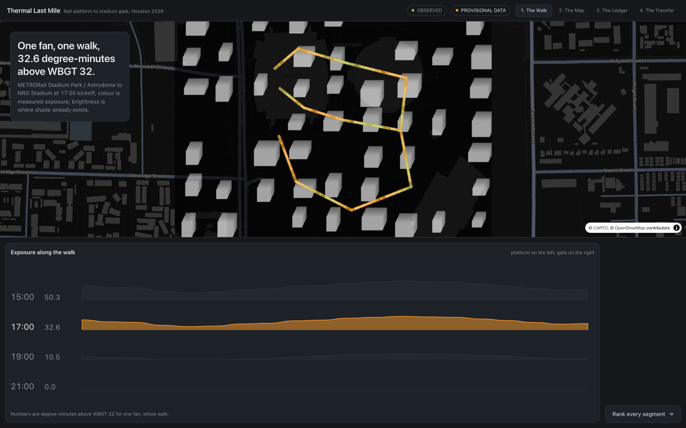
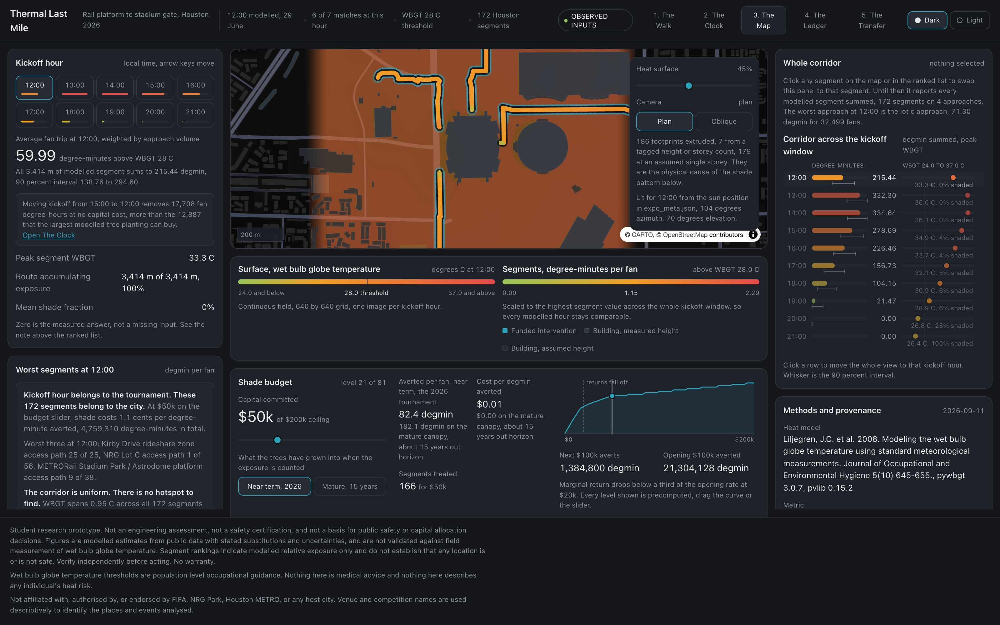
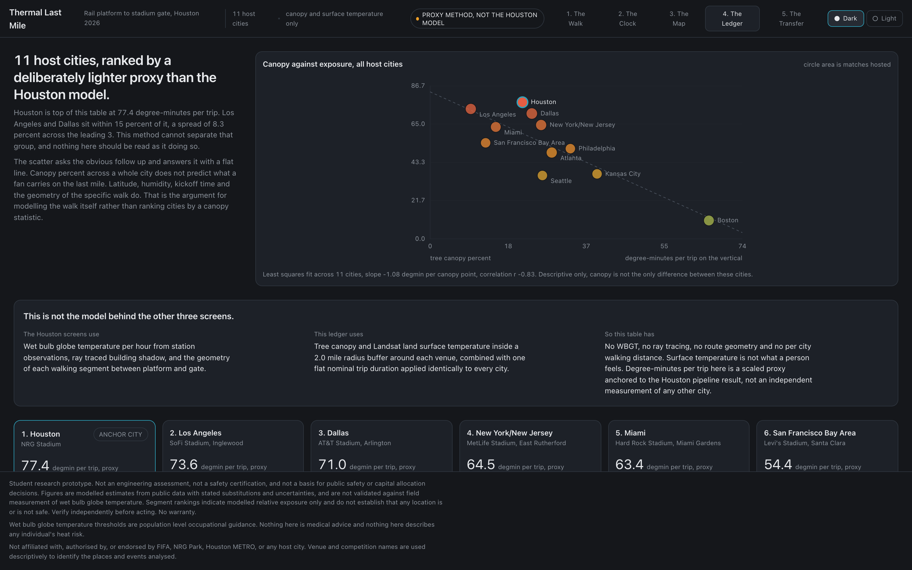
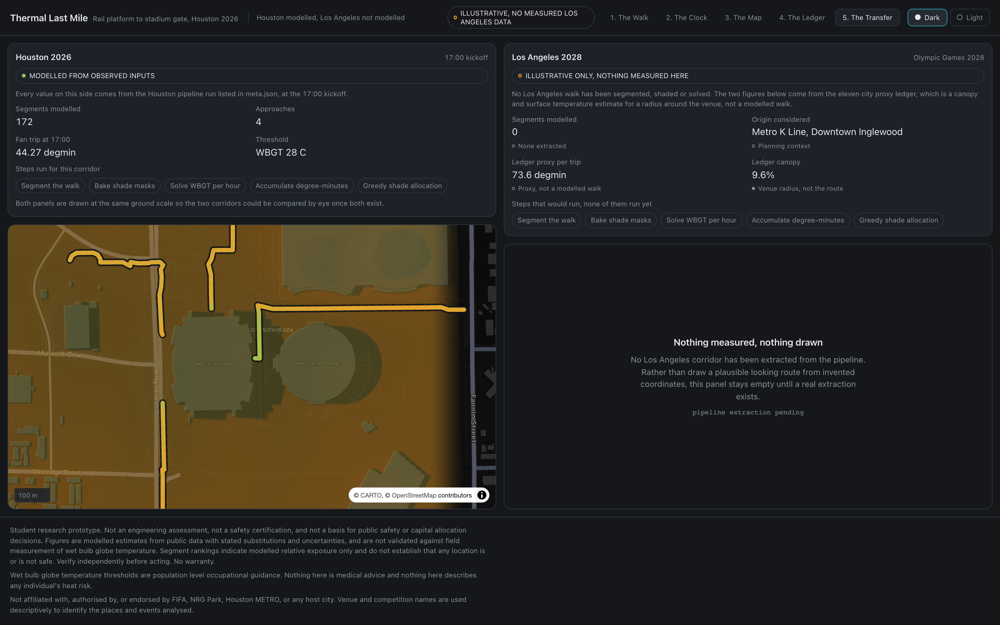

# Thermal Last Mile

Segment level heat exposure on the walk from the METRORail Stadium Park / Astrodome
platform to the NRG Stadium gates, priced per degree-minute averted.

The walk from the train to the gate is the hottest part of a World Cup trip and nobody
measures it. This project measures it, ranks every sidewalk segment by how much
dangerous heat a fan actually absorbs crossing it, and reports where a fixed shade
budget removes the most exposure per dollar.

The headline the project exists to support: **X fan-hours of dangerous heat exposure
happened on the last mile to NRG, Y percent of it was avoidable for Z dollars, and here
is the ranked list of where.**

## The metric

Degree-minutes above WBGT 32, accumulated by one fan walking a segment at 1.3 m/s.

Wet bulb globe temperature is the heat stress standard used by OSHA, the military and
athletics governing bodies, because it combines dry bulb temperature, humidity, wind and
radiant load. Plain air temperature does not describe what a body on a sidewalk
experiences. WBGT 32 is the continuous exertion limit.

Exposure is integrated along the path rather than sampled at a point. Two projects can
report the same peak temperature. Only one can say how long a fan spent above the
threshold and where the shaded relief happened to fall.

## Screens

### The Walk

One fan journey, platform to gate, with the exposure profile beneath it and particles
running the path recoloured by shade.



### The Map

The working view. Segment exposure across the catchment, a ranked list, a shade budget
bar, an hour scrubber, and a methods panel that stays on screen.



### The Ledger

Eleven host cities sorted by exposure per fan trip, Houston highlighted. This is the
comparative claim, and it deliberately uses a lighter method than the Houston model.



### The Transfer

The same method applied to LA 2028 venue geography, which is the legacy argument.



## How it works

The physics runs offline and the browser only draws.

```
                    OFFLINE                          STATIC              BROWSER

  ASOS  NSRDB  Landsat  LiDAR  OSM  GTFS
        |
   s1 network      OSM pedestrian graph
   s2 wbgt         Liljegren WBGT per cell per hour
   s3 shadow       vectorised raymarch, boolean shade mask   -->  shade_{hh}.png
   s4 surface      exposure raster per kickoff hour
   s5 routes       route, split, integrate along path        -->  segments.geojson
   s6 optimize     cost effectiveness greedy, 81 levels      -->  solutions.json
   s7 cities       eleven city comparison                    -->  cities.json
   meta            provenance generated, never typed         -->  meta.json
                                                                        |
                                                                   renderer
```

If a value can appear on screen, it exists on disk before the browser opens. The budget
slider does not solve an optimization, it indexes an array. The hour scrubber does not
compute a shadow, it crossfades two baked masks. There is no server, no API and no
database, so there is nothing to cold start, exceed a quota, or go down during judging.

### Shade enters the physics correctly

Shade is computed in the raster domain as a boolean mask per cell, which can be
multiplied, summed and integrated along a path. A shadow rendered as a WebGL lighting
effect darkens pixels on a screen and cannot produce a number.

A shaded pedestrian receives diffuse irradiance only, so shade enters the WBGT
calculation by removing the direct beam from the solar input, not by subtracting an
invented constant from globe temperature. Verified on representative late June Houston
conditions, the same block at the same hour is WBGT 32.8 in full sun and 30.0 in shade.

### Allocation

Shade placement under a budget is a constrained facility location problem. The solver is a
**cost effectiveness greedy heuristic**: it repeatedly buys whichever remaining
(segment, intervention) pair averts the most degree-minutes per dollar, sweeping the full
budget range offline across 81 levels. Dragging the slider is an array lookup, so the
interaction is instant and cannot fail.

It is a heuristic and it is described as one. Ratio greedy under a budget constraint
carries no approximation guarantee, unlike greedy under a cardinality constraint, so no
bound is claimed here. What the method does offer is transparency: every selection is
explainable as a price per degree-minute, the full path is auditable, and the ranked
output is a list a public works department can act on.

## Data sources

The table separates what actually produces the Houston number from what the comparative
screen uses and what remains planned. Every claim on screen is traceable to a row marked
IN USE, and `meta.json` is generated by the pipeline so this cannot drift.

| Layer | Product | Provider | Status |
| --- | --- | --- | --- |
| Air temp, dew point, wind, pressure | ASOS hourly, KHOU, KIAH, KSGR | Iowa Environmental Mesonet | IN USE, Houston model |
| Building heights for shading | OSM building footprints, 783 buildings, height and building:levels tags | OpenStreetMap | IN USE, substituted for LiDAR |
| Pedestrian network | OSM walk graph, 12,121 nodes and 32,397 edges | OpenStreetMap | IN USE, Houston model |
| Venue footprint and gates | OSM building=stadium way | OpenStreetMap | IN USE, gates approximated |
| Solar irradiance | pvlib clearsky Ineichen | pvlib | IN USE, substituted for NSRDB |
| Canopy | NLCD Tree Canopy Cover 2021 | MRLC | IN USE, eleven city ledger only |
| Surface temperature | Landsat C2 L2 ST_B10, 2018 to 2024 summer scenes | USGS via Planetary Computer | IN USE, eleven city ledger only |
| LiDAR derived DSM | TNRIS and USGS 3DEP | TNRIS, USGS | NOT USED, OSM footprints substituted |
| Solar irradiance, measured | NSRDB PSM v3 | NREL | NOT USED, requires an API key |
| Social vulnerability | SVI, tract level | CDC and ATSDR | NOT USED, ships as 0.0 on every segment |
| Transit schedule | METRO GTFS | Houston METRO | NOT USED, origins are fixed coordinates |

### Honest limitations

Substitutions are recorded rather than hidden, because a judge who checks will find them
anyway and the discipline is worth more than the appearance of completeness.

- The digital surface model comes from OSM footprints, not LiDAR, so building heights
  carry tag error and a 3.5 m per storey default where tags are absent.
- Solar irradiance is clear sky, not measured, so cloud attenuation is not represented.
  This biases exposure high on cloudy match days.
- Airport wind is corrected to 2 m pedestrian height with a log profile over a 0.03 m
  roughness length, which is the right direction but a blunt instrument in a street canyon.
- Stadium gates are eight evenly spaced perimeter points because no OSM entrance nodes
  exist on the way.
- Fan volume per approach is a stated modelling assumption, not an observation, and the
  ranking is weighted by it.
- Validation covers the spatial interpolation of station observations, not the WBGT model
  itself, because no instrumented WBGT record exists for this site and these dates.
  Leave one out cross validation across three stations gives RMSE 0.82 C and bias 0.02 C.

The organiser sources are named on screen in the methods panel and the curated catalog is
vendored at `data/raw/organizers/`.

## Repository layout

```
pipeline/     offline stages, config.yml and costs.yml
data/raw/     downloads, gitignored, sidecar JSON per request
data/interim/ rasters, gitignored
data/out/     committed application payload
web/          Vite, React, MapLibre GL JS, deck.gl, zustand
docs/         contracts, narrative, validation, provenance
```

## Running it

Pipeline:

```
uv venv --python 3.11 .venv
uv pip install --python .venv/bin/python -r requirements.txt
.venv/bin/python pipeline/run_all.py
```

Stages skip any output that already exists. Pass `--force` to rebuild.

Application:

```
cd web
npm install
npm run dev
npm run build
```

## Design

Dark base, two colour encodings and no more: one sequential ramp for exposure, one accent
for interventions. A judge seeing the map for the first time can hold two encodings in
their head, not four.

| Token | Value |
| --- | --- |
| Page | `#15171B` |
| Panel | `#1D2128` |
| Border | `#2E353E` |
| Text | `#E7E9EC` and `#8B929B` |
| Exposure low | `#97C459` |
| Exposure moderate | `#EF9F27` |
| Exposure severe | `#E24B4A` |
| Intervention | `#2DA2BB` |

Performance targets: first paint under 2 s, hour change to recolour under 250 ms, budget
drag at 60 fps with zero recompute, and zero network calls after load beyond basemap
tiles.

## Output for a public works department

The Map screen exports the ranked segment list as CSV with costs attached, so the result
is an artifact an agency can open on Monday rather than only a demo.

## Status

The application runs end to end. Screens above are rendered from contract shaped
provisional data while the physics pipeline finishes; the interface shows a PROVISIONAL
DATA chip whenever that is true, and the chip disappears when real pipeline output
replaces it. No code changes when the data is swapped, because both halves were built
against a frozen contract.

## Licence

Code under MIT. Data products retain the licences of their providers, recorded per layer
in `meta.json`.
